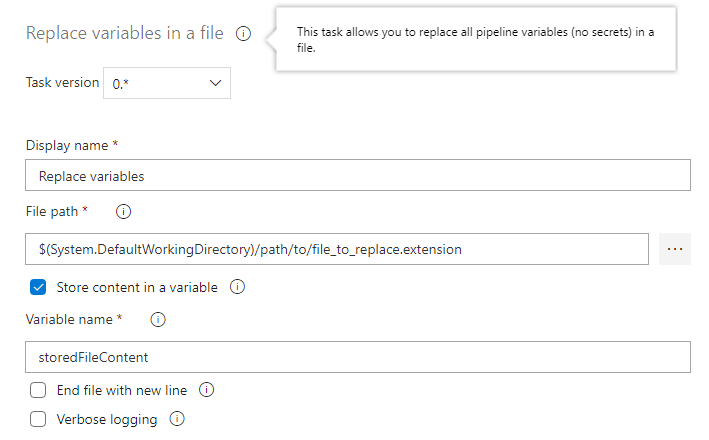

# Replace variables in file

This task allows you to replaces the pipeline variables in a file with their corresponding values *(not secrets)* during a build or release process. With the task you can specify the file that you want to replace his variable in format **$(\[a-zA-Z0-9_\])**.

## NOTES

### IMPORTANT: Secret variables

Due to a security restriction, Azure DevOps does not allow us to access secret variables, for this reason the secret variables are replaced as a string of asterisks (**'\*\*\*'**), to avoid this we recommend to use secret files instead of secret variables.

### Variable scope

Each pipeline variable has a scope, if this task runs in a stage outside the scope of a variable this will not be able to get its value.

## Options

### File path

With this property you can specify the path of the file including its name. Example: 'folder/filename.txt'.

### Content to variable

When this is checked, the file content will be store in a variable.

### Variable name

Only when the option "Content to variable" is set to true this field works, This is the name of the variable that will store the file content.

### End file with a new line

When this is checked, the task will automatically add a new line at the end of the file.

### Verbose logging

When this is checked, the task write detailed process logs.